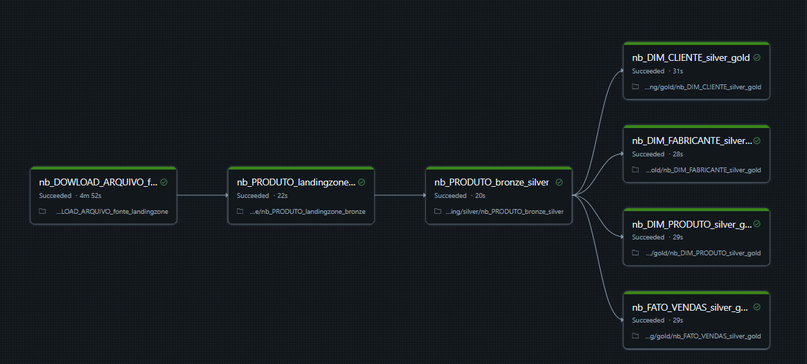
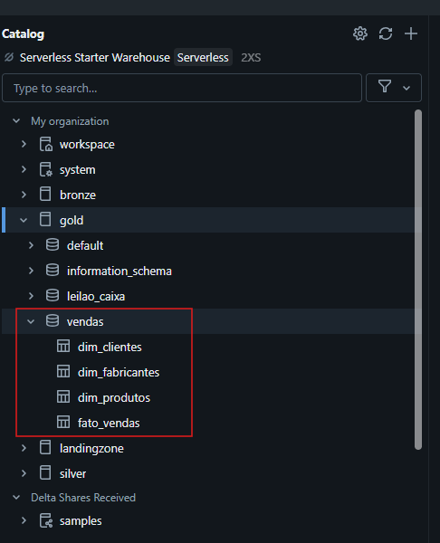

# Projeto Databricks: Pipeline com Web Scraping

## Descrição

Este projeto tem como objetivo construir um pipeline de dados no Databricks que:

1. Realiza o download de um arquivo de dados público (Excel, CSV ou JSON) via web scraping.
2. Salva o arquivo bruto no volume `landingzone`.
3. Lê o arquivo e grava os dados em formato Parquet no volume `bronze`.
4. Converte os dados Parquet para Delta e salva no volume `silver`.
5. Cria uma tabelas Delta no catálogo `gold` para consulta analítica.
6. Automatiza o pipeline através da criação de um Job no Databricks.

## Fonte dos dados

Para o download, utilize um dos arquivos públicos disponíveis, por exemplo:

- CSV: [https://github.com/andrerosa77/trn-pyspark/raw/main/](https://raw.githubusercontent.com/andrerosa77/trn-pyspark/main/dados_2011.csv)  

## Estrutura do pipeline

| Camada       | Descrição                          | Volume Databricks          |
|--------------|----------------------------------|----------------------------|
| Landingzone  | Arquivo original baixado bruto   | `/Volumes/landingzone/`    |
| Bronze       | Dados estruturados em Parquet    | `/Volumes/bronze/`         |
| Silver       | Dados convertidos para Delta     | `/Volumes/silver/`         |
| Gold         | Tabela Delta para análise        | Catálogo `gold`            |

## Instruções

1. Execute o notebook para:
   - Baixar o arquivo via web scraping.
   - Salvar o arquivo bruto em `landingzone`.
   - Ler os dados, salvar em Parquet no `bronze`.
   - Converter para Delta no `silver`.
   - Criar tabela Delta no catálogo `gold`.

2. Crie um Job no Databricks para agendar e automatizar a execução do pipeline.
   

## Requisitos

- Cluster Databricks com permissões para volumes e Unity Catalog.
- Bibliotecas Python instaladas: `requests`, `pandas`, `openpyxl` (para Excel).
- Acesso à internet para download do arquivo público.

## Resultado esperado

- Arquivo original salvo no volume `landingzone`.
- Dados Parquet no volume `bronze`.
- Dados Delta no catálogo `silver`.
- Tabelas Delta criada no catálogo `gold` acessível para consultas.

